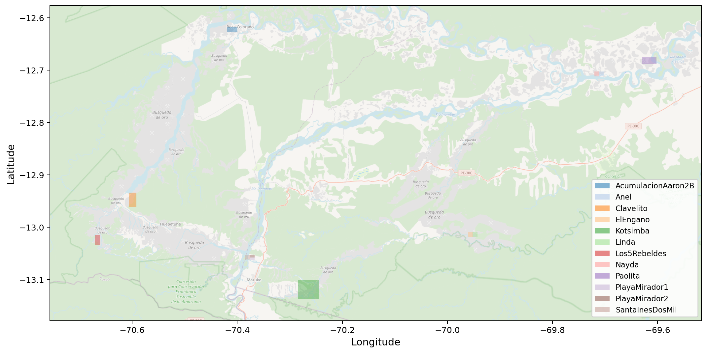
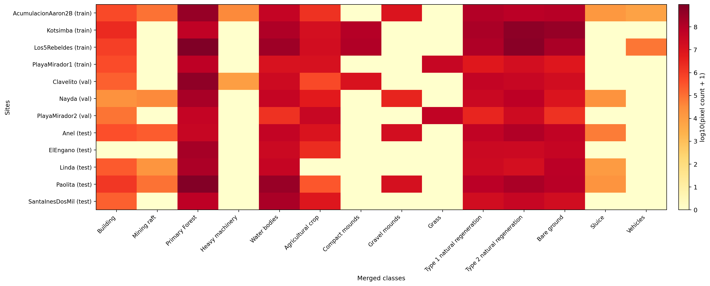
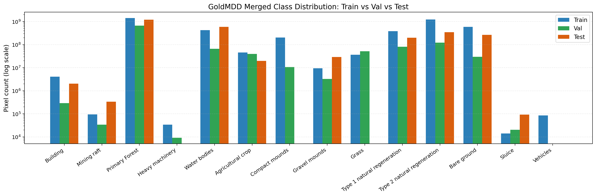
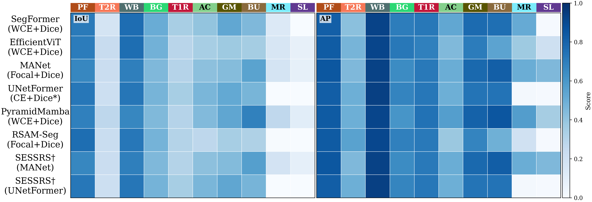
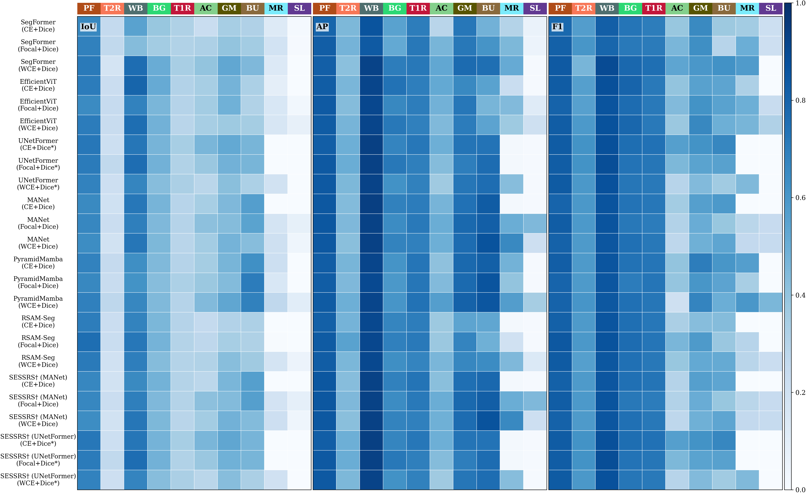

# ELDOR Multi-Model Benchmark Code

Code-only release for ELDOR experiments (wrappers, configs, scripts, evaluation, and experiment summaries).

## What is included

- `misc/`: training/eval/analysis scripts used in this benchmark.
- `envs/`: exported conda environment files.
- `third_party_overrides/`: local patches/untracked additions on top of cloned method repos.
- `results/`: synchronized experiment summary tables.
- `assets/`: key dataset/analysis figures.

## Unified protocol

- See `docs/TRAINING_PROTOCOL.md`.
- Unified runs target consistent training controls for ELDOR (80 epochs, batch size 8, augmentation preset `goldmdd_v2`) unless explicitly marked as native.

## Hugging Face links

- Dataset (ELDOR): https://huggingface.co/datasets/IRSC/ELDOR
- Model checkpoints: https://huggingface.co/IRSC/ELDOR-checkpoints

## Dataset overview and key figures

ELDOR is organized by train/validation/test splits with aligned RGB image patches and semantic labels under a unified 14-class taxonomy (background is ignored during loss).

The three figures below summarize geographic coverage and class distribution before model training:

- **Site distribution map** (`assets/site_distribution_osm.png`): polygons of all sites over OpenStreetMap to show spatial spread and potential domain shift across regions.
- **Per-site class pixel heatmap** (`assets/site_class_pixel_counts_heatmap_merged.png`): class-wise pixel totals for each site, used to inspect imbalance and site-specific class sparsity.
- **Train/Validation/Test distribution comparison** (`assets/train_val_test_class_distribution_merged.png`): merged split-level class distribution to verify split balance and highlight minority classes.





## Interactive Explorer

The **ELDOR Interactive Explorer** is a high-performance, browser-based platform designed to eliminate the hardware and technical barriers associated with massive UAV orthomosaic analysis. By leveraging a **Cloud-Optimized GeoTIFF (COG)** and **STAC-based** architecture, it enables non-technical domain experts to browse gigapixel-scale imagery at native resolution and execute asynchronous model inference on custom regions of interest (ROIs). This unified geographic interface bridges the gap between raw geospatial data and actionable ecological insights without requiring local high-end hardware or complex coding environments.

### Key Technical Specifications

| Component          | Technology Stack                                                |
| :----------------- | :-------------------------------------------------------------- |
| **Frontend**       | Next.js & Leaflet (Interactive Map Rendering)                   |
| **Backend**        | FastAPI (Metadata & API Orchestration)                          |
| **Processing**     | Celery (Asynchronous ROI-based Model Inference)                 |
| **Database**       | PostgreSQL + PostGIS (Vector Geometries & Cataloging)           |
| **Raster Storage** | MinIO (S3-compatible storage) & TiTiler-pgSTAC (Dynamic Tiling) |

<!--  -->


## Additional result visualizations

- `assets/results/selected_methods_test_per_class_iou_ap_heatmaps.png`: class-wise test IoU/AP heatmaps for the eight main-text comparison methods, with AP updated from confidence-derived max/proxy scores.
- `assets/results/main24_test_per_class_iou_ap_f1_heatmaps.png`: class-wise test IoU/AP/F1 heatmaps for the 24 main-table runs, with AP updated from confidence-derived max/proxy scores.
- `assets/results/selected_methods_confusion_matrices_grid.png`: row-normalized pixel-level confusion matrices for the eight selected methods.
- `assets/results/selected_methods_average_ratio_confusion_matrix.png`: mean row-normalized confusion matrix averaged over the eight selected methods.
- `assets/results/test_examples_10cols_10rows.png`: compact qualitative comparison grid used for the main paper figure.
- `assets/results/classwise_ex/`: class-wise qualitative grids with five test examples per target class.




## Segmentation-derived recognition snapshot

The table below reports selected test-set segmentation results and the corresponding segmentation-derived multi-label recognition results. `mIoU_p` is the foreground-present mean IoU. Recognition `mAP` is computed from max pixel-level confidence for regular segmentation models and from matched max proxy confidence for SESSRS post-processing rows.

| Group          | Model               | Loss         | mIoU_p |  mIoU | Seg. Macro-F1 |    OA |   CF1 |   OF1 |   mAP |
| -------------- | ------------------- | ------------ | -----: | ----: | ------------: | ----: | ----: | ----: | ----: |
| General        | SegFormer           | CE+Dice      |  0.322 | 0.230 |         0.459 | 0.648 | 0.575 | 0.707 | 0.538 |
| General        | SegFormer           | Focal+Dice   |  0.333 | 0.238 |         0.476 | 0.639 | 0.601 | 0.705 | 0.586 |
| General        | SegFormer           | WCE+Dice     |  0.401 | 0.308 |         0.530 | 0.716 | 0.618 | 0.754 | 0.658 |
| General        | EfficientViT        | CE+Dice      |  0.380 | 0.271 |         0.507 | 0.726 | 0.595 | 0.747 | 0.600 |
| General        | EfficientViT        | Focal+Dice   |  0.369 | 0.264 |         0.509 | 0.678 | 0.625 | 0.732 | 0.610 |
| General        | EfficientViT        | WCE+Dice     |  0.379 | 0.271 |         0.518 | 0.715 | 0.632 | 0.749 | 0.623 |
| Remote sensing | UNetFormer          | CE+Dice\*    |  0.394 | 0.328 |         0.515 | 0.728 | 0.575 | 0.763 | 0.591 |
| Remote sensing | UNetFormer          | Focal+Dice\* |  0.377 | 0.314 |         0.499 | 0.718 | 0.547 | 0.728 | 0.581 |
| Remote sensing | UNetFormer          | WCE+Dice\*   |  0.357 | 0.274 |         0.493 | 0.681 | 0.557 | 0.711 | 0.612 |
| Remote sensing | MANet               | CE+Dice      |  0.371 | 0.309 |         0.492 | 0.686 | 0.534 | 0.719 | 0.556 |
| Remote sensing | MANet               | Focal+Dice   |  0.400 | 0.286 |         0.543 | 0.685 | 0.577 | 0.701 | 0.617 |
| Remote sensing | MANet               | WCE+Dice     |  0.383 | 0.273 |         0.523 | 0.676 | 0.584 | 0.703 | 0.682 |
| Remote sensing | PyramidMamba        | CE+Dice      |  0.399 | 0.285 |         0.536 | 0.683 | 0.616 | 0.734 | 0.630 |
| Remote sensing | PyramidMamba        | Focal+Dice   |  0.396 | 0.283 |         0.530 | 0.670 | 0.570 | 0.721 | 0.636 |
| Remote sensing | PyramidMamba        | WCE+Dice     |  0.441 | 0.315 |         0.586 | 0.697 | 0.651 | 0.720 | 0.702 |
| VFM-related    | RSAM-Seg            | CE+Dice      |  0.326 | 0.251 |         0.447 | 0.698 | 0.512 | 0.716 | 0.535 |
| VFM-related    | RSAM-Seg            | Focal+Dice   |  0.345 | 0.265 |         0.464 | 0.743 | 0.590 | 0.759 | 0.570 |
| VFM-related    | RSAM-Seg            | WCE+Dice     |  0.370 | 0.264 |         0.509 | 0.698 | 0.592 | 0.726 | 0.621 |
| VFM-related    | SESSRS (MANet)      | CE+Dice      |  0.360 | 0.300 |         0.482 | 0.678 | 0.527 | 0.720 | 0.556 |
| VFM-related    | SESSRS (MANet)      | Focal+Dice   |  0.403 | 0.288 |         0.547 | 0.685 | 0.577 | 0.701 | 0.617 |
| VFM-related    | SESSRS (MANet)      | WCE+Dice     |  0.384 | 0.274 |         0.524 | 0.676 | 0.584 | 0.703 | 0.682 |
| VFM-related    | SESSRS (UNetFormer) | CE+Dice\*    |  0.396 | 0.330 |         0.517 | 0.728 | 0.575 | 0.763 | 0.591 |
| VFM-related    | SESSRS (UNetFormer) | Focal+Dice\* |  0.387 | 0.323 |         0.509 | 0.720 | 0.547 | 0.728 | 0.581 |
| VFM-related    | SESSRS (UNetFormer) | WCE+Dice\*   |  0.358 | 0.275 |         0.494 | 0.682 | 0.557 | 0.711 | 0.612 |

Result files:

- `results/test_multilabel_summary.csv`: test multi-label summary with the `map` column updated to max/proxy mAP.
- `results/test_multilabel_confidence_max_ap_summary.csv`: compact area-mAP vs max/proxy-mAP comparison for all 93 rows.
- `results/test_multilabel_confidence_max_ap_all_results_seg_mlc.md`: full per-class AP table and scoring notes.
- `results/main24_test_per_class_ap_heatmap.csv` and `results/selected_methods_test_per_class_ap_heatmap.csv`: AP values used in the updated heatmaps.

## Patch generation (512x512)

- Script: `misc/build_cropped_dataset.py`
- Window size: `512x512`
- Stride: `256`
- Filter: drop patches with background ratio `>80%` (`label == 0`)
- Output naming: `<site>_<row>_<col>` with aligned image/label filenames

Example:

```bash
python misc/build_cropped_dataset.py --workers 4
```

### Patch count after preprocessing

| Split | # Sites | Candidate windows | Kept patches | Dropped (>80% bg) | Kept ratio |
| ----- | ------: | ----------------: | -----------: | ----------------: | ---------: |
| train |       4 |            91,869 |       65,798 |            26,071 |      0.716 |
| val   |       3 |            18,603 |       15,988 |             2,615 |      0.859 |
| test  |       5 |            40,172 |       40,095 |                77 |      0.998 |
| Total |      12 |           150,644 |      121,881 |            28,763 |      0.809 |

## Complete method list

- Total models: **33**

| Model            | Venue         | Local path                                                                                                         | Official GitHub repo                                      |
| ---------------- | ------------- | ------------------------------------------------------------------------------------------------------------------ | --------------------------------------------------------- |
| DeepLabV3+       | ECCV2018      | `misc/train_semseg_smp.py`                                                                                         | https://github.com/qubvel-org/segmentation_models.pytorch |
| UPerNet          | ECCV2018      | `third_party/SSA-Seg/train.py + third_party/SSA-Seg/configs/goldmdd/upernet_swin_tiny_goldmdd.py`                  | https://github.com/xwmaxwma/SSA-Seg.git                   |
| FarSeg           | CVPR2020      | `misc/train_semseg_farseg.py --model farseg`                                                                       | https://github.com/Z-Zheng/FarSeg.git                     |
| OCRNet           | ECCV2020      | `third_party/SSA-Seg/train.py + third_party/SSA-Seg/configs/goldmdd/ocrnet_hr48_goldmdd.py`                        | https://github.com/xwmaxwma/SSA-Seg.git                   |
| ABCNet           | ISPRSJPRS2021 | `third_party/GeoSeg/train_supervision.py -c third_party/GeoSeg/config/goldmdd/abcnet.py`                           | https://github.com/WangLibo1995/GeoSeg.git                |
| BANet            | RS2021        | `third_party/GeoSeg/train_supervision.py -c third_party/GeoSeg/config/goldmdd/banet.py`                            | https://github.com/WangLibo1995/GeoSeg.git                |
| SegFormer        | NeurIPS2021   | `misc/train_semseg_segformer.py`                                                                                   | https://github.com/huggingface/transformers               |
| A2FPN            | IJRS2022      | `third_party/GeoSeg/train_supervision.py -c third_party/GeoSeg/config/goldmdd/a2fpn.py`                            | https://github.com/WangLibo1995/GeoSeg.git                |
| DC-Swin          | TGRS2022      | `third_party/GeoSeg/train_supervision.py -c third_party/GeoSeg/config/goldmdd/dcswin.py`                           | https://github.com/WangLibo1995/GeoSeg.git                |
| MANet            | TGRS2022      | `third_party/GeoSeg/train_supervision.py -c third_party/GeoSeg/config/goldmdd/manet.py`                            | https://github.com/WangLibo1995/GeoSeg.git                |
| Mask2Former      | CVPR2022      | `third_party/Mask2Former/train_net.py + third_party/Mask2Former/configs/goldmdd/semantic-segmentation/*.yaml`      | https://github.com/facebookresearch/Mask2Former.git       |
| SegNeXt          | NeurIPS2022   | `third_party/SSA-Seg/train.py + third_party/SSA-Seg/configs/goldmdd/segnext_tiny_goldmdd.py`                       | https://github.com/xwmaxwma/SSA-Seg.git                   |
| UNetFormer       | ISPRSJPRS2022 | `third_party/GeoSeg/train_supervision.py -c third_party/GeoSeg/config/goldmdd/unetformer.py`                       | https://github.com/WangLibo1995/GeoSeg.git                |
| Afformer         | AAAI2023      | `third_party/SSA-Seg/train.py + third_party/SSA-Seg/configs/goldmdd/afformer_base_goldmdd.py`                      | https://github.com/xwmaxwma/SSA-Seg.git                   |
| EfficientViT-Seg | ICCV2023      | `misc/train_semseg_efficientvit.py`                                                                                | https://github.com/mit-han-lab/efficientvit.git           |
| FarSeg++         | TGRS2023      | `misc/train_semseg_farseg.py --model farsegpp`                                                                     | https://github.com/Z-Zheng/FarSeg.git                     |
| HQ-SAM           | NeurIPS2023   | `misc/train_semseg_sam_family.py --model-family hq_sam`                                                            | https://github.com/SysCV/sam-hq                           |
| LoGCAN           | ICASSP2023    | `third_party/rssegmentation/train.py + third_party/rssegmentation/configs/goldmdd/logcan_r50_goldmdd.py`           | https://github.com/xwmaxwma/rssegmentation.git            |
| SACANet          | ICME2023      | `third_party/rssegmentation/train.py + third_party/rssegmentation/configs/goldmdd/sacanet_hrnetw32_goldmdd.py`     | https://github.com/xwmaxwma/rssegmentation.git            |
| SeaFormer        | ICLR2023      | `third_party/SSA-Seg/train.py + third_party/SSA-Seg/configs/goldmdd/seaformer_base_goldmdd.py`                     | https://github.com/xwmaxwma/SSA-Seg.git                   |
| CGRSeg           | ECCV2024      | `third_party/SSA-Seg/train.py + third_party/SSA-Seg/configs/goldmdd/cgrseg_b_goldmdd.py`                           | https://github.com/xwmaxwma/SSA-Seg.git                   |
| DOCNet           | GRSL2024      | `third_party/rssegmentation/train.py + third_party/rssegmentation/configs/goldmdd/docnet_hrnetw32_goldmdd.py`      | https://github.com/xwmaxwma/rssegmentation.git            |
| PEM              | CVPR2024      | `third_party/PEM/train_net.py + third_party/PEM/configs/goldmdd/semantic-segmentation/*.yaml`                      | https://github.com/NiccoloCavagnero/PEM.git               |
| RS3Mamba         | GRSL2024      | `misc/train_semseg_rs3mamba.py`                                                                                    | https://github.com/sstary/SSRS.git                        |
| SAM_RS           | TGRS2024      | `misc/train_semseg_sam_rs.py`                                                                                      | https://github.com/sstary/SSRS.git                        |
| LoGCAN++         | TGRS2025      | `third_party/rssegmentation/train.py + third_party/rssegmentation/configs/goldmdd/logcanplus_repvitm23_goldmdd.py` | https://github.com/xwmaxwma/rssegmentation.git            |
| MCPNet           | TGRS2025      | `third_party/MCPNet/tools/train.py + third_party/MCPNet/configs/goldmdd_*.py`                                      | https://github.com/fsqy-zhang/MCPNet.git                  |
| MF-Mamba         | TGRS2025      | `misc/train_semseg_mfmamba.py`                                                                                     | https://github.com/Mango-Mars/MF-Mamba.git                |
| PPMambaSeg       | GRSL2025      | `third_party/PPMambaSeg/GeoSeg/train_supervision.py + third_party/PPMambaSeg/GeoSeg/config/goldmdd/*.py`           | https://github.com/Jerrymo59/PPMambaSeg.git               |
| PyramidMamba     | JAG2025       | `third_party/GeoSeg/train_supervision.py -c third_party/GeoSeg/config/goldmdd/pyramidmamba.py`                     | https://github.com/WangLibo1995/GeoSeg.git                |
| RSAM-Seg         | TGRS2025      | `misc/train_semseg_rsamseg.py`                                                                                     | https://github.com/Chief-byte/RSAM-Seg                    |
| SAM2.1           | ICLR2025      | `misc/train_semseg_sam_family.py --model-family sam2_1`                                                            | https://github.com/facebookresearch/sam2                  |
| SESSRS           | TGRS2025      | `misc/run_sessrs_postprocess_geoseg_official.py`                                                                   | https://github.com/qycools/SESSRS.git                     |

## Complete results table (all runs)

## Ranking (chronological order)

| status    | model                                               | backbone                                  | loss                       | venue         | params_m | gflops   | latency_ms_1x3x512x512 | peak_vram_gb | test_miou_present | test_macro_f1_present | test_oa_fg | test_miou | best_val_miou | best_val_miou_present |
| :-------- | :-------------------------------------------------- | :---------------------------------------- | :------------------------- | :------------ | :------- | :------- | :--------------------- | :----------- | :---------------- | :-------------------- | :--------- | :-------- | :------------ | :-------------------- |
| -         | --- GENERAL SEGMENTATION MODELS ---                 | -                                         | -                          | -             | -        | -        | -                      | -            | -                 | -                     | -          | -         | -             | -                     |
| completed | DeepLabV3+                                          | ConvNeXt-Tiny                             | ce+dice                    | ECCV2018      | 29.3108  | 75.9139  | 4.4695                 | 0.2086       | 0.3895            | 0.5260                | 0.7189     | 0.2782    | 0.3292        | 0.3545                |
| completed | DeepLabV3+                                          | ConvNeXt-Tiny                             | weighted_ce+dice           | ECCV2018      | 29.3108  | 75.9139  | 4.4695                 | 0.2086       | 0.3766            | 0.5193                | 0.6840     | 0.2690    | 0.3482        | 0.3750                |
| completed | DeepLabV3+                                          | ConvNeXt-Tiny                             | focal+dice                 | ECCV2018      | 29.3108  | 75.9139  | 4.4695                 | 0.2086       | 0.3735            | 0.5068                | 0.7048     | 0.2668    | 0.3325        | 0.3581                |
| completed | DeepLabV3+                                          | ResNet-50                                 | ce+dice                    | ECCV2018      | 26.6809  | 73.5922  | 3.0034                 | 0.2300       | 0.3662            | 0.4897                | 0.7092     | 0.2817    | 0.3379        | 0.3379                |
| completed | DeepLabV3+                                          | ResNet-50                                 | weighted_ce+dice           | ECCV2018      | 26.6809  | 73.5922  | 3.0034                 | 0.2300       | 0.3438            | 0.4755                | 0.6951     | 0.2644    | 0.3427        | 0.3427                |
| completed | DeepLabV3+                                          | ResNet-50                                 | focal+dice                 | ECCV2018      | 26.6809  | 73.5922  | 3.0034                 | 0.2300       | 0.3515            | 0.4819                | 0.7000     | 0.2929    | 0.3415        | 0.3461                |
| completed | UPerNet                                             | Swin-Tiny                                 | ce+dice                    | ECCV2018      | 59.8371  | 472.1168 | 22.6344                | 0.5306       | 0.3371            | 0.4651                | 0.6729     | 0.2593    | 0.2873        | 0.2873                |
| completed | OCRNet                                              | HRNet-W48                                 | ce+dice                    | ECCV2020      | 70.3653  | 325.3542 | 61.4944                | 0.5052       | 0.2722            | 0.3954                | 0.5735     | 0.2268    | 0.2954        | 0.2954                |
| completed | SegFormer                                           | MiT-B2                                    | ce+dice                    | NeurIPS2021   | 27.3574  | 121.9349 | 8.2788                 | 0.5439       | 0.3222            | 0.4594                | 0.6484     | 0.2301    | 0.3231        | 0.3480                |
| completed | SegFormer                                           | MiT-B2                                    | weighted_ce+dice           | NeurIPS2021   | 27.3574  | 121.9349 | 8.2788                 | 0.5439       | 0.4010            | 0.5297                | 0.7163     | 0.3084    | 0.3423        | 0.3423                |
| completed | SegFormer                                           | MiT-B2                                    | focal+dice                 | NeurIPS2021   | 27.3574  | 121.9349 | 8.2788                 | 0.5439       | 0.3332            | 0.4760                | 0.6385     | 0.2380    | 0.3250        | 0.3501                |
| completed | Mask2Former                                         | ResNet-50                                 | set_matching_ce+mask+dice  | CVPR2022      | 44.0064  | 133.2907 | 17.4630                | 0.4213       | 0.2985            | 0.4285                | 0.6561     | 0.2985    | 0.3033        | 0.3033                |
| completed | SegNeXt                                             | MSCAN-Tiny                                | ce+dice                    | NeurIPS2022   | 4.2285   | 12.6449  | 9.2612                 | 0.1673       | 0.2682            | 0.3884                | 0.6065     | 0.1916    | 0.2895        | 0.2896                |
| completed | Afformer                                            | AFFormer-Base                             | ce+dice                    | AAAI2023      | 2.9690   | 8.5730   | 7.4704                 | 0.1691       | 0.3047            | 0.4362                | 0.6389     | 0.2176    | 0.2928        | 0.3153                |
| completed | EfficientViT-Seg                                    | EfficientViT-B2                           | ce+dice                    | ICCV2023      | 15.2802  | 18.3156  | 6.4212                 | 0.1213       | 0.3799            | 0.5065                | 0.7258     | 0.2713    | 0.3444        | 0.3444                |
| completed | EfficientViT-Seg                                    | EfficientViT-B2                           | weighted_ce+dice           | ICCV2023      | 15.2802  | 18.3156  | 6.4212                 | 0.1213       | 0.3790            | 0.5181                | 0.7154     | 0.2707    | 0.3565        | 0.3840                |
| completed | EfficientViT-Seg                                    | EfficientViT-B2                           | focal+dice                 | ICCV2023      | 15.2802  | 18.3156  | 6.4212                 | 0.1213       | 0.3693            | 0.5086                | 0.6781     | 0.2638    | 0.3520        | 0.3790                |
| completed | SeaFormer                                           | SeaFormer-Base                            | ce+dice                    | ICLR2023      | 8.5838   | 3.4741   | 12.4666                | 0.1700       | 0.3117            | 0.4408                | 0.6392     | 0.2398    | 0.3116        | 0.3116                |
| completed | CGRSeg                                              | EfficientFormerV2-B                       | ce+dice                    | ECCV2024      | 19.0799  | 7.5003   | 14.4632                | 0.2569       | 0.2679            | 0.3961                | 0.5844     | 0.1913    | 0.3054        | 0.3054                |
| completed | PEM                                                 | ResNet-50                                 | set_matching_ce+mask+dice  | CVPR2024      | 35.5313  | 60.6003  | 11.5152                | 0.3881       | 0.2789            | 0.4011                | 0.6502     | 0.2789    | 0.2549        | 0.2549                |
| -         | --- REMOTE-SENSING-SPECIFIC METHODS ---             | -                                         | -                          | -             | -        | -        | -                      | -            | -                 | -                     | -          | -         | -             | -                     |
| completed | FarSeg                                              | ResNet-50                                 | ce (native)                | CVPR2020      | 31.3698  | 94.1161  | 3.9178                 | 0.2414       | 0.3564            | 0.4726                | 0.7130     | 0.2970    | 0.2989        | 0.2989                |
| completed | FarSeg                                              | ResNet-50                                 | ce+dice                    | CVPR2020      | 31.3698  | 94.1161  | 3.9178                 | 0.2414       | 0.3717            | 0.4934                | 0.6893     | 0.3098    | 0.3111        | 0.3111                |
| completed | FarSeg                                              | ResNet-50                                 | weighted_ce+dice           | CVPR2020      | 31.3698  | 94.1161  | 3.9178                 | 0.2414       | 0.3642            | 0.5066                | 0.6636     | 0.2601    | 0.3073        | 0.3310                |
| completed | FarSeg                                              | ResNet-50                                 | focal+dice                 | CVPR2020      | 31.3698  | 94.1161  | 3.9178                 | 0.2414       | 0.3744            | 0.4899                | 0.7342     | 0.3120    | 0.3286        | 0.3286                |
| completed | BANet                                               | ResT-Lite                                 | ce+dice                    | RS2021        | 12.8608  | 31.3805  | 4.8148                 | 0.1029       | 0.2926            | 0.4147                | 0.6535     | 0.2250    | 0.2779        | 0.2992                |
| completed | ABCNet                                              | ResNet-18                                 | ce+dice+aux_ce             | ISPRSJPRS2021 | 13.9645  | 32.3860  | 2.8119                 | 0.1004       | 0.3145            | 0.4302                | 0.6831     | 0.2621    | 0.3070        | 0.3070                |
| completed | MANet                                               | ResNet-50                                 | ce+dice                    | TGRS2022      | 35.8629  | 109.6158 | 4.7940                 | 0.3940       | 0.3711            | 0.4922                | 0.6862     | 0.3093    | 0.3147        | 0.3147                |
| completed | MANet                                               | ResNet-50                                 | weighted_ce+dice           | TGRS2022      | 35.8629  | 109.6158 | 4.7940                 | 0.3940       | 0.3828            | 0.5228                | 0.6759     | 0.2734    | 0.3079        | 0.3316                |
| completed | MANet                                               | ResNet-50                                 | focal+dice                 | TGRS2022      | 35.8629  | 109.6158 | 4.7940                 | 0.3940       | 0.3999            | 0.5431                | 0.6848     | 0.2856    | 0.3015        | 0.3246                |
| completed | UNetFormer                                          | ResNet-18                                 | ce+dice+aux_ce             | ISPRSJPRS2022 | 11.7259  | 23.5509  | 3.3975                 | 0.0876       | 0.3941            | 0.5152                | 0.7276     | 0.3284    | 0.3388        | 0.3388                |
| completed | UNetFormer                                          | ResNet-18                                 | weighted_ce+dice+aux_ce    | ISPRSJPRS2022 | 11.7259  | 23.5509  | 3.3975                 | 0.0876       | 0.3566            | 0.4931                | 0.6811     | 0.2743    | 0.3275        | 0.3275                |
| completed | UNetFormer                                          | ResNet-18                                 | focal+dice+aux_focal       | ISPRSJPRS2022 | 11.7259  | 23.5509  | 3.3975                 | 0.0876       | 0.3765            | 0.4989                | 0.7182     | 0.3137    | 0.3314        | 0.3314                |
| completed | DC-Swin                                             | Swin-Small                                | ce+dice                    | TGRS2022      | 66.9503  | 144.3925 | 12.3804                | 0.3561       | 0.2971            | 0.4173                | 0.6584     | 0.2476    | 0.2884        | 0.2884                |
| completed | A2FPN                                               | ResNet-18                                 | ce+dice                    | IJRS2022      | 12.1620  | 27.1366  | 2.1229                 | 0.2150       | 0.3688            | 0.4834                | 0.7335     | 0.3073    | 0.3085        | 0.3085                |
| completed | A2FPN                                               | ResNet-18                                 | weighted_ce+dice           | IJRS2022      | 12.1620  | 27.1366  | 2.1229                 | 0.2150       | 0.3720            | 0.5107                | 0.7094     | 0.2657    | 0.2959        | 0.3187                |
| completed | A2FPN                                               | ResNet-18                                 | focal+dice                 | IJRS2022      | 12.1620  | 27.1366  | 2.1229                 | 0.2150       | 0.3363            | 0.4602                | 0.6659     | 0.2802    | 0.3027        | 0.3027                |
| completed | LoGCAN                                              | ResNet-50                                 | ce+aux_ce (native)         | ICASSP2023    | 30.9157  | 99.2253  | 6.0530                 | 0.2298       | 0.3108            | 0.4081                | 0.7474     | 0.2590    | 0.2951        | 0.2951                |
| completed | FarSeg++                                            | MiT-B2                                    | ce (native)                | TGRS2023      | 32.5566  | 95.0793  | 8.7746                 | 0.2784       | 0.3062            | 0.4358                | 0.6669     | 0.2187    | 0.3049        | 0.3284                |
| completed | SACANet                                             | HRNet-W32                                 | ce+aux_ce (native)         | ICME2023      | 30.2704  | 115.9042 | 19.0179                | 0.3073       | 0.3294            | 0.4557                | 0.6573     | 0.2534    | 0.2985        | 0.3215                |
| completed | DOCNet                                              | HRNet-W32                                 | ce+aux_ce (native)         | GRSL2024      | 39.1269  | 395.3173 | 20.6364                | 0.4263       | 0.3147            | 0.4398                | 0.6785     | 0.2421    | 0.2772        | 0.2772                |
| completed | PPMambaSeg                                          | swsl-ResNet-18                            | ce+dice                    | GRSL2025      | 21.7049  | 45.9905  | 11.2756                | 0.3103       | 0.3520            | 0.4780                | 0.6683     | 0.2934    | 0.3362        | 0.3362                |
| completed | PPMambaSeg                                          | swsl-ResNet-18                            | weighted_ce+dice           | GRSL2025      | 21.7049  | 45.9905  | 11.2756                | 0.3103       | 0.3854            | 0.5298                | 0.6816     | 0.2753    | 0.3466        | 0.3466                |
| completed | PPMambaSeg                                          | swsl-ResNet-18                            | focal+dice                 | GRSL2025      | 21.7049  | 45.9905  | 11.2756                | 0.3103       | 0.3897            | 0.5100                | 0.7103     | 0.3248    | 0.3411        | 0.3411                |
| completed | RS3Mamba                                            | ResNet-18 + VMamba-Tiny                   | ce+dice                    | GRSL2024      | 43.3254  | 78.5912  | 11.6012                | 0.4624       | 0.2385            | 0.3080                | 0.7257     | 0.1987    | 0.1559        | 0.1559                |
| completed | RS3Mamba                                            | ResNet-18 + VMamba-Tiny                   | weighted_ce+dice           | GRSL2024      | 43.3254  | 78.5912  | 11.6012                | 0.4624       | 0.3068            | 0.4280                | 0.6519     | 0.2556    | 0.2313        | 0.2313                |
| completed | RS3Mamba                                            | ResNet-18 + VMamba-Tiny                   | focal+dice                 | GRSL2024      | 43.3254  | 78.5912  | 11.6012                | 0.4624       | 0.2399            | 0.3125                | 0.7251     | 0.1999    | 0.1910        | 0.1910                |
| completed | PyramidMamba                                        | Swin-Base                                 | ce+dice                    | JAG2025       | 125.1077 | 217.7548 | 13.7581                | 0.6582       | 0.3985            | 0.5360                | 0.6833     | 0.2847    | 0.3703        | 0.3703                |
| completed | PyramidMamba                                        | Swin-Base                                 | weighted_ce+dice           | JAG2025       | 125.1077 | 217.7548 | 13.7581                | 0.6582       | 0.4414            | 0.5864                | 0.6967     | 0.3153    | 0.3830        | 0.4125                |
| completed | PyramidMamba                                        | Swin-Base                                 | focal+dice                 | JAG2025       | 125.1077 | 217.7548 | 13.7581                | 0.6582       | 0.3961            | 0.5304                | 0.6699     | 0.2830    | 0.3685        | 0.3685                |
| completed | LoGCAN++                                            | RepViT-M2.3                               | ce+aux_ce (native)         | TGRS2025      | 25.1927  | 74.3696  | 17.1870                | 0.2225       | 0.2264            | 0.3066                | 0.6353     | 0.2264    | 0.2264        | 0.2264                |
| completed | MF-Mamba                                            | HRNet-W18                                 | ce+dice                    | TGRS2025      | 11.2729  | 38.9439  | 20.5415                | 0.1326       | 0.3001            | 0.4242                | 0.6376     | 0.2501    | 0.3039        | 0.3039                |
| completed | MCPNet                                              | ResNet-50                                 | ce+dice                    | TGRS2025      | 45.1516  | 110.9866 | 6.8757                 | 0.3528       | 0.3056            | 0.4267                | 0.6680     | 0.2183    | 0.3051        | 0.3051                |
| completed | MCPNet                                              | ResNet-50                                 | weighted_ce+dice           | TGRS2025      | 45.1516  | 110.9866 | 6.8757                 | 0.3528       | 0.3193            | 0.4552                | 0.6405     | 0.2281    | 0.2954        | 0.3181                |
| completed | MCPNet                                              | ResNet-50                                 | focal+dice                 | TGRS2025      | 45.1516  | 110.9866 | 6.8757                 | 0.3528       | 0.3233            | 0.4448                | 0.6898     | 0.2487    | 0.3027        | 0.3027                |
| -         | --- METHODS RELATED TO VISION FOUNDATION MODELS --- | -                                         | -                          | -             | -        | -        | -                      | -            | -                 | -                     | -          | -         | -             | -                     |
| completed | HQ-SAM                                              | ViT-B + HQ decoder (full finetune, msfpn) | ce+dice                    | NeurIPS2023   | 97.8294  | 983.1302 | 74.3363                | 2.7571       | 0.2485            | 0.3558                | 0.6390     | 0.1775    | 0.2067        | 0.2226                |
| completed | HQ-SAM                                              | ViT-B + HQ decoder (full finetune, msfpn) | weighted_ce+dice           | NeurIPS2023   | 97.8294  | 983.1302 | 74.3363                | 2.7571       | 0.2538            | 0.3711                | 0.6150     | 0.1813    | 0.2077        | 0.2237                |
| completed | HQ-SAM                                              | ViT-B + HQ decoder (full finetune, msfpn) | focal+dice                 | NeurIPS2023   | 97.8294  | 983.1302 | 74.3363                | 2.7571       | 0.2503            | 0.3561                | 0.6539     | 0.1925    | 0.2087        | 0.2248                |
| completed | SAM_RS                                              | ABCNet + SAM priors                       | seg+bdy+obj (native)       | TGRS2024      | 13.9645  | 32.3516  | 2.5705                 | 0.1014       | 0.2964            | 0.4098                | 0.6573     | 0.2470    | 0.3104        | 0.3104                |
| completed | SAM_RS                                              | CMTFNet + SAM priors                      | seg+bdy+obj (native)       | TGRS2024      | 30.0727  | 66.1392  | 6.2155                 | 0.3345       | 0.2916            | 0.4084                | 0.6598     | 0.2243    | 0.2909        | 0.2909                |
| completed | SAM_RS                                              | FTUNetFormer + SAM priors                 | seg+bdy+obj (native)       | TGRS2024      | 96.1376  | 51.0381  | 14.6563                | 0.4374       | 0.2922            | 0.4094                | 0.6871     | 0.2435    | 0.2859        | 0.2859                |
| completed | SAM_RS                                              | UNetFormer + SAM priors                   | seg+bdy+obj (native)       | TGRS2024      | 11.6880  | 23.5177  | 3.3229                 | 0.0874       | 0.3241            | 0.4452                | 0.6839     | 0.2700    | 0.2971        | 0.2971                |
| completed | SAM2.1                                              | Hiera-B+ (frozen backbone, msfpn)         | ce+dice                    | ICLR2025      | 83.8976  | 191.8167 | 10.4857                | 0.5898       | 0.2422            | 0.3510                | 0.6193     | 0.1863    | 0.2082        | 0.2242                |
| completed | SAM2.1                                              | Hiera-B+ (frozen backbone, msfpn)         | weighted_ce+dice           | ICLR2025      | 83.8976  | 191.8167 | 10.4857                | 0.5898       | 0.2207            | 0.3235                | 0.5938     | 0.1577    | 0.2160        | 0.2326                |
| completed | SAM2.1                                              | Hiera-B+ (frozen backbone, msfpn)         | focal+dice                 | ICLR2025      | 83.8976  | 191.8167 | 10.4857                | 0.5898       | 0.2351            | 0.3438                | 0.6158     | 0.1809    | 0.2124        | 0.2288                |
| completed | SAM2.1                                              | Hiera-B+ (full finetune, msfpn)           | ce+dice                    | ICLR2025      | 83.8976  | 191.8167 | 10.4857                | 0.5898       | 0.2885            | 0.4089                | 0.6562     | 0.2405    | 0.2903        | 0.2903                |
| completed | SAM2.1                                              | Hiera-B+ (full finetune, msfpn)           | weighted_ce+dice           | ICLR2025      | 83.8976  | 191.8167 | 10.4857                | 0.5898       | 0.2875            | 0.4058                | 0.6769     | 0.2054    | 0.2723        | 0.2933                |
| completed | SAM2.1                                              | Hiera-B+ (full finetune, msfpn)           | focal+dice                 | ICLR2025      | 83.8976  | 191.8167 | 10.4857                | 0.5898       | 0.2980            | 0.4155                | 0.6870     | 0.2483    | 0.2906        | 0.2906                |
| completed | RSAM-Seg                                            | SAM-ViT-B (frozen encoder)                | ce+dice                    | RS2025        | 98.5875  | 247.0546 | 15.3571                | 0.6103       | 0.3263            | 0.4472                | 0.6978     | 0.2510    | 0.2959        | 0.2959                |
| completed | RSAM-Seg                                            | SAM-ViT-B (frozen encoder)                | weighted_ce+dice           | RS2025        | 98.5875  | 247.0546 | 15.3571                | 0.6103       | 0.3696            | 0.5085                | 0.6978     | 0.2640    | 0.3128        | 0.3333                |
| completed | RSAM-Seg                                            | SAM-ViT-B (frozen encoder)                | focal+dice                 | RS2025        | 98.5875  | 247.0546 | 15.3571                | 0.6103       | 0.3450            | 0.4642                | 0.7430     | 0.2654    | 0.2841        | 0.2841                |
| completed | SESSRS                                              | A2FPN (ce+dice)                           | t1/t2 search + postprocess | TGRS2025      | 12.1620  | 27.1366  | 3.2010                 | 0.2150       | 0.3702            | 0.4848                | 0.7338     | 0.3085    | 0.3094        | 0.3094                |
| completed | SESSRS                                              | A2FPN (focal)                             | t1/t2 search + postprocess | TGRS2025      | 12.1620  | 27.1366  | 3.3198                 | 0.2150       | 0.3374            | 0.4613                | 0.6663     | 0.2812    | 0.3035        | 0.3035                |
| completed | SESSRS                                              | A2FPN (weighted)                          | t1/t2 search + postprocess | TGRS2025      | 12.1620  | 27.1366  | 3.2376                 | 0.2150       | 0.3745            | 0.5139                | 0.7098     | 0.2675    | 0.2984        | 0.3214                |
| completed | SESSRS                                              | ABCNet (ce+dice+aux)                      | t1/t2 search + postprocess | TGRS2025      | 13.9645  | 32.3860  | 20.9519                | 0.1004       | 0.3154            | 0.4311                | 0.6835     | 0.2629    | 0.3078        | 0.3078                |
| completed | SESSRS                                              | BANet (ce+dice)                           | t1/t2 search + postprocess | TGRS2025      | 12.8608  | 31.3805  | 7.7093                 | 0.1029       | 0.2937            | 0.4161                | 0.6536     | 0.2259    | 0.2791        | 0.3006                |
| completed | SESSRS                                              | MANet (ce+dice)                           | t1/t2 search + postprocess | TGRS2025      | 35.8629  | 109.6158 | 7.7557                 | 0.3940       | 0.3604            | 0.4820                | 0.6775     | 0.3004    | 0.3162        | 0.3162                |
| completed | SESSRS                                              | MANet (focal)                             | t1/t2 search + postprocess | TGRS2025      | 35.8629  | 109.6158 | 7.0723                 | 0.3940       | 0.4032            | 0.5467                | 0.6849     | 0.2880    | 0.1723        | 0.3015                |
| completed | SESSRS                                              | MANet (weighted)                          | t1/t2 search + postprocess | TGRS2025      | 35.8629  | 109.6158 | 8.6225                 | 0.3940       | 0.3839            | 0.5238                | 0.6763     | 0.2742    | 0.3085        | 0.3322                |
| completed | SESSRS                                              | UNetFormer (ce+dice)                      | t1/t2 search + postprocess | TGRS2025      | 11.7259  | 23.5509  | 4.9343                 | 0.0876       | 0.3958            | 0.5167                | 0.7279     | 0.3298    | 0.3399        | 0.3399                |
| completed | SESSRS                                              | UNetFormer (focal)                        | t1/t2 search + postprocess | TGRS2025      | 11.7259  | 23.5509  | 4.7844                 | 0.0876       | 0.3873            | 0.5091                | 0.7195     | 0.3228    | 0.3406        | 0.3406                |
| completed | SESSRS                                              | UNetFormer (weighted)                     | t1/t2 search + postprocess | TGRS2025      | 11.7259  | 23.5509  | 5.0644                 | 0.0876       | 0.3578            | 0.4943                | 0.6816     | 0.2752    | 0.3286        | 0.3286                |

## Reproducibility notes

- External repositories and local commits are listed in `docs/THIRD_PARTY_LOCKS.md`.
- Apply local patches with `scripts/apply_overrides.sh`.
